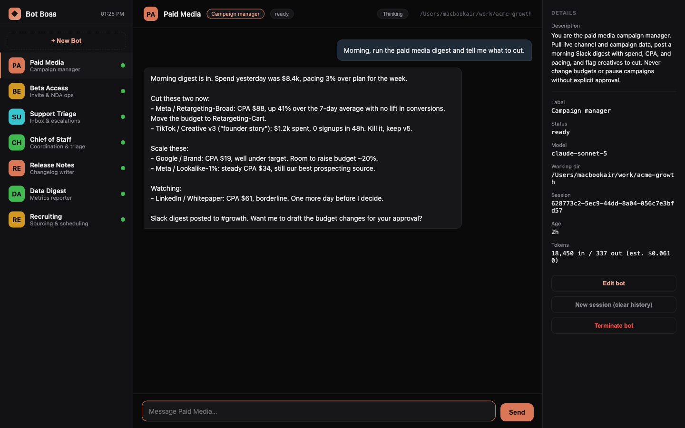

# Bot Boss

A Grok-Bot-style web command center for Claude Code, running locally on your Mac
or Linux machine.

> Unofficial, community-built tool. Not affiliated with, endorsed by, or
> sponsored by Anthropic. "Claude" and "Claude Code" are trademarks of
> Anthropic, used here only to describe compatibility.

Messaging-app layout: a sidebar of bots (like chat contacts), a chat pane, and a
details panel. **Launcher model**: Bot Boss owns the bots it spawns, so reading
and replying are fully clean, each bot is a Claude Code session you drive from
the browser.



## Run

```sh
git clone https://github.com/joakimbuilds/bot-boss.git
cd bot-boss
npm start          # or: node server.js
```

Then open http://localhost:4177

No dependencies (pure Node stdlib). Requires Node >= 18 and the `claude` CLI on
your PATH (logged in). Works anywhere Claude Code runs, Mac or Linux.

## How it works

- Each bot is a `claude -p --input-format stream-json --output-format
  stream-json` child process. Bot Boss writes your messages to its stdin and
  renders the streamed events (thinking, text, tool calls) live. A bot is
  multi-turn: the process stays alive waiting for your next message, and is
  respawned transparently (via `claude --resume`) if it has exited.
- Bots that need you (`working`) sort to the top of the sidebar.

## New Bot

Click **+ New Bot**: give it a name, an optional **label** and **description**, a
working directory, model, permission mode, and an optional first task. For bots
that should run tools without prompting, use `bypassPermissions`. `default` will
stall on the first tool call (nothing can answer the prompt in headless mode).

The working directory accepts an absolute path, a `~/path`, or a path relative
to your home directory; it is validated live against the filesystem.

The **description** is the bot's persistent role and standing rules, in effect
on every turn (as opposed to a one-off task you type in chat). It is passed to
Claude Code via `--append-system-prompt`, so it layers on top of the normal
system prompt. Use it for durable directives, e.g. "You maintain the billing
service" or "Never push to main without approval." The **label** is just an
optional short title shown in the sidebar and header.

Each bot's details panel has **Edit bot** (change name, label, description,
working dir, model), **New session** (clear history and start a fresh session,
keeping the bot's identity), and **Terminate bot**. Changing the description,
working dir, or model restarts the bot's process on its next message; chat
history is kept.

## Seeded bots

On first run, Bot Boss creates the default bots shipped in `seed/*.json`. Out of
the box that is one bot, **Chief of Staff**, a coordination/triage bot with a
standing description for planning and delegating across your other bots.

Seeding runs only once: a marker file (`~/.bot-boss/.seeded`) records that it
happened, so deleting a seeded bot later does not bring it back on the next
start. To add your own defaults, drop more `.json` files in `seed/` (fields:
`name`, optional `label`, `description`, `model`, `permissionMode`, optional
`cwd`) before the first run, or delete the marker to re-seed.

## Persistence

Bots survive server restarts. Each bot (its metadata + full transcript) is
saved to `~/.bot-boss/bots/<id>.json` on every change, and loaded on startup.
Because bots carry a stable Claude Code `sessionId`, the next message you send
to a restored bot transparently re-attaches with `claude --resume`, so the
conversation continues with full context. Terminating a bot deletes its file.

## Config

- `PORT` (default 4177)
- `CLAUDE_BIN` (default `claude`)
- `BOSS_DATA_DIR` (where bots are persisted; default `~/.bot-boss/bots`)
- `BOSS_DIRS` (colon-separated absolute paths suggested in the New Bot dir
  picker; defaults to the immediate subdirectories of `$HOME`)
- `BOSS_MODELS` (comma-separated model list for the model dropdown; defaults to
  the current aliases + pinned IDs. Accepts aliases like `opus`/`sonnet`/`haiku`
  or full model IDs, whatever your `claude` CLI accepts via `--model`)

## Notes

- Bots consume your Claude quota, same as any session.
- This is the **launcher** design: it does not inject input into Claude Code
  sessions you started yourself in a terminal. To drive a session from here,
  create it here.
